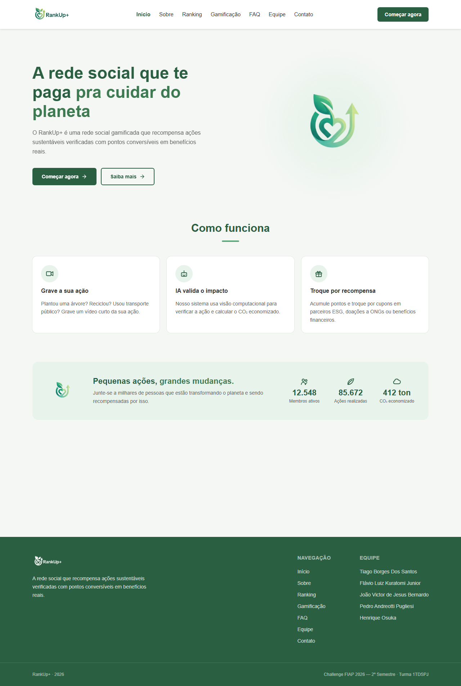
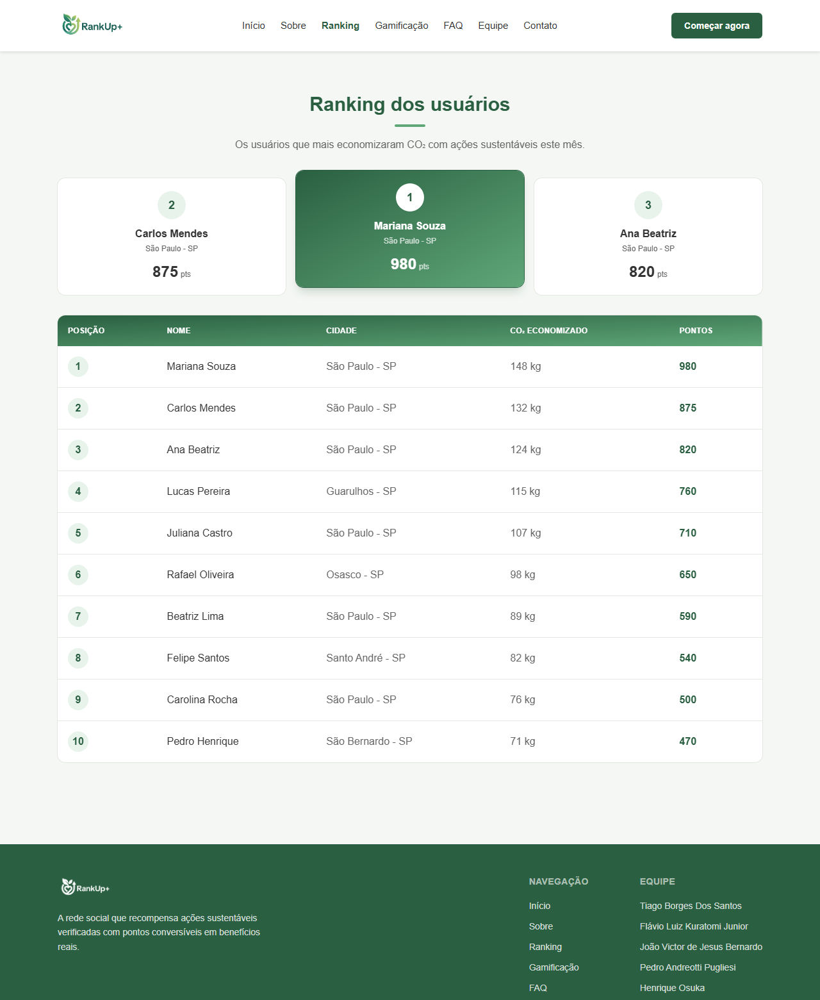
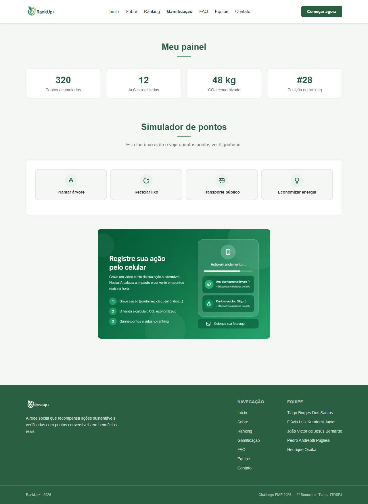
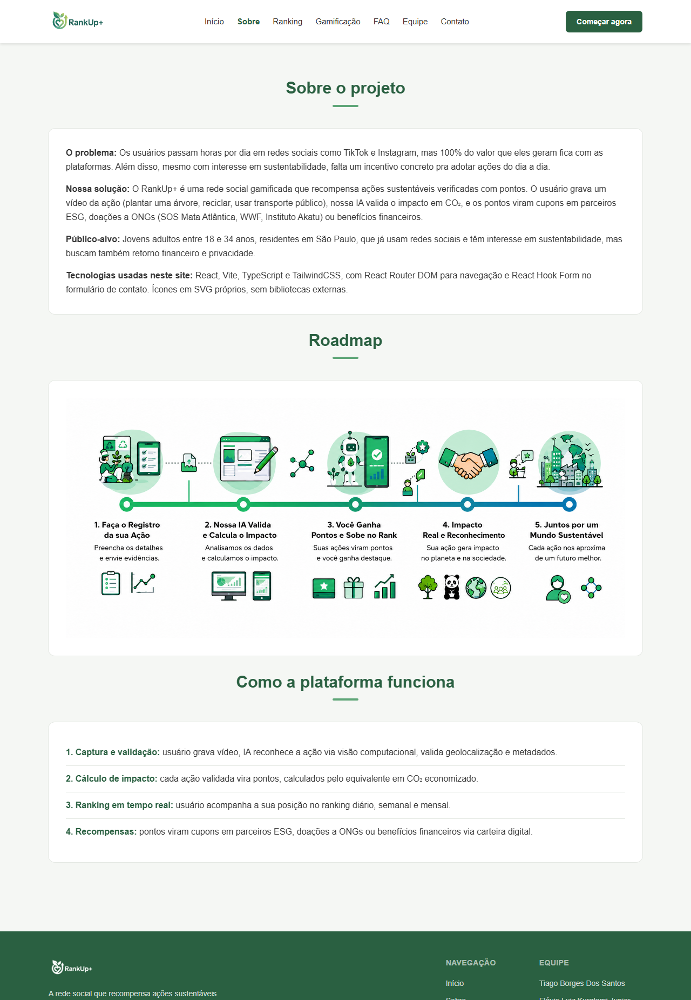
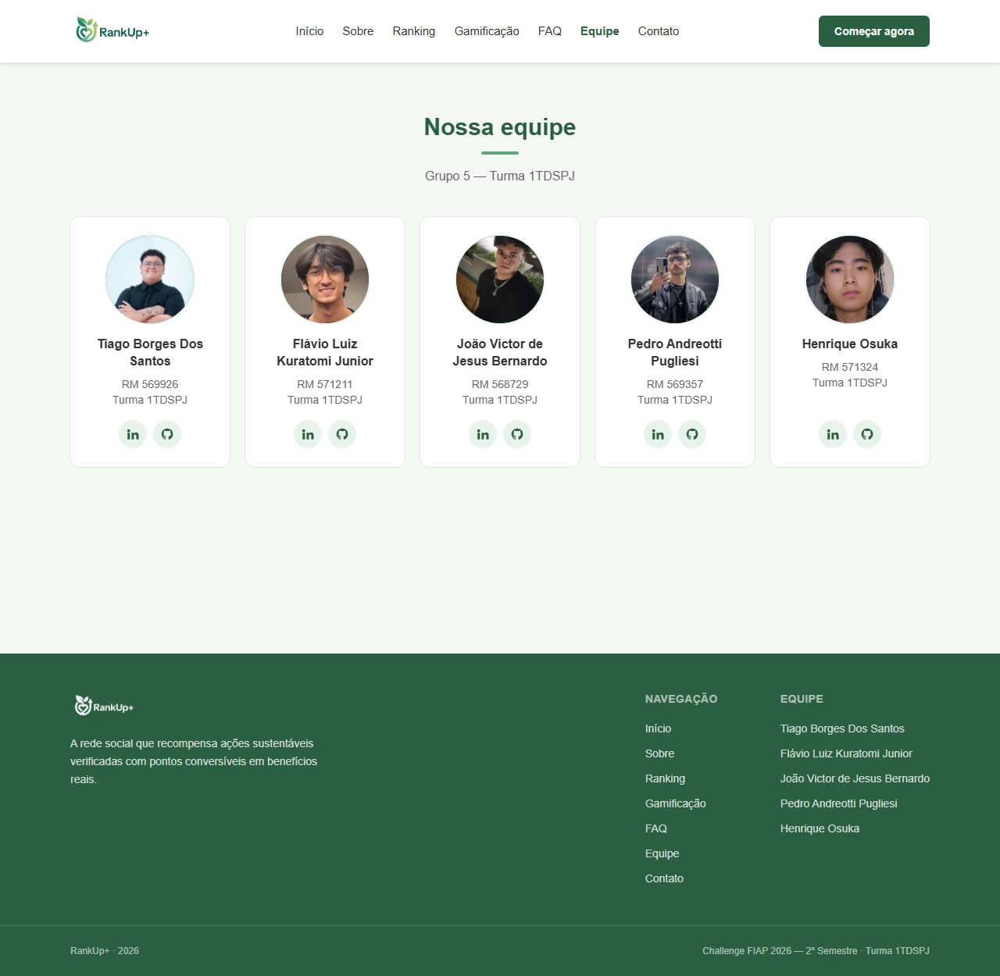
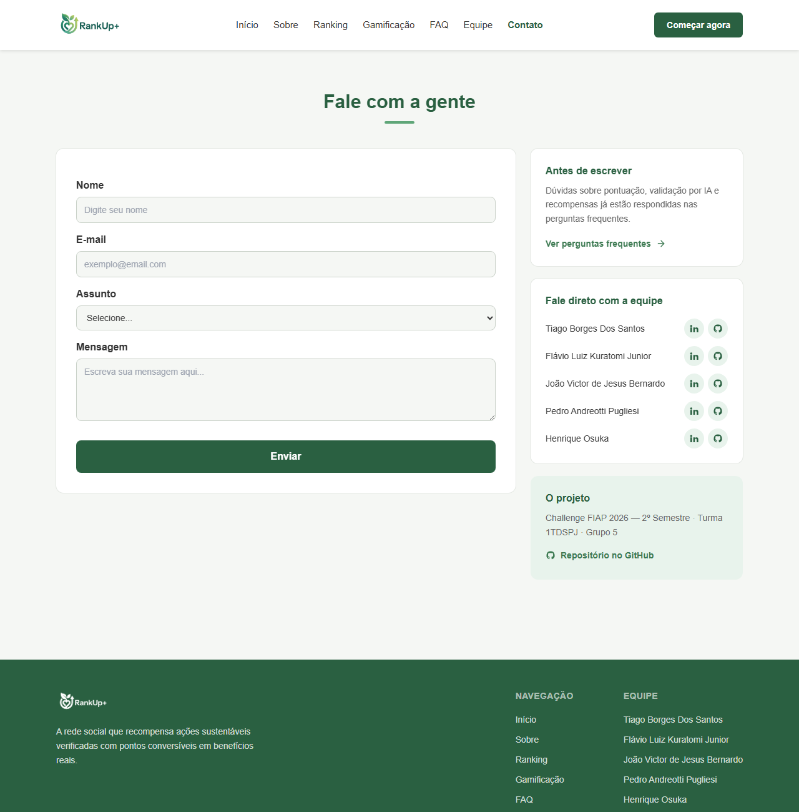

# 🌱 RankUp+ — Sistema de Gamificação Sustentável


> Projeto desenvolvido como parte do **Challenge FIAP 2026 — 2º Semestre**, em parceria com a **SoulUp**.
> **Turma 1TDSPJ · Grupo 5**

---

## 📌 Sobre o Projeto

O **RankUp+** é a interface web do **Sistema de Gamificação Sustentável** da plataforma SoulUp. O objetivo é incentivar práticas sustentáveis dentro da comunidade de usuários, transformando ações ecológicas em **pontuação justa e escalável**, com um ranking que recompensa os usuários mais engajados.

A plataforma permite que o usuário:

- 📹 Envie vídeos comprovando ações sustentáveis (plantar árvores, reciclar, usar transporte público, economizar energia)
- 🤖 Tenha a ação analisada automaticamente por visão computacional, com validação de geolocalização e metadados
- 🏆 Acumule pontos calculados pelo equivalente em CO₂ economizado
- 📊 Acompanhe seu desempenho em um ranking diário, semanal e mensal
- 🎁 Troque pontos por cupons em parceiros ESG, doações a ONGs (SOS Mata Atlântica, WWF, Instituto Akatu) ou benefícios financeiros

### Sobre esta entrega (Sprint 03)

Esta sprint migrou o projeto de **HTML/CSS/JavaScript estático** para uma **SPA em React**. Toda a estilização foi reescrita em classes utilitárias do TailwindCSS, o JavaScript imperativo foi substituído por estado do React, e os dados que antes estavam fixos no HTML foram extraídos para arrays tipados em `src/data/`.

---

## 🛠️ Tecnologias Utilizadas

| Tecnologia | Versão | Finalidade |
|------------|--------|------------|
| **React** | 18.3 | Biblioteca de interface, componentização e estado |
| **Vite** | 5.4 | Build tool e servidor de desenvolvimento |
| **TypeScript** | 5.6 | Tipagem estática  |
| **TailwindCSS** | 3.4 | Estilização por classes utilitárias e design tokens |
| **React Router DOM** | 6.26 | Roteamento da SPA, incluindo rotas dinâmicas |
| **React Hook Form** | 7.53 | Formulário de contato e validações |
| **Git & GitHub** | — | Versionamento, branches por feature e colaboração |

> ⚠️ O projeto **não usa nenhuma biblioteca de componentes de UI** (Bootstrap, Material UI, shadcn/ui, etc.) nem biblioteca de ícones. Todos os ícones são componentes de SVG inline escritos à mão em `src/components/icons/`. Também não há cliente HTTP, já que não há consumo de API.

---

## 🚀 Como Executar o Projeto

**Pré-requisito:** Node.js 18 ou superior.

```bash
# 1. Clone o repositório
git clone https://github.com/RankUp-TDSPJ/RankUp-Front.git

# 2. Acesse a pasta do projeto
cd RankUp-Front

# 3. Instale as dependências
npm install

# 4. Suba o servidor de desenvolvimento
npm run dev
```

O projeto ficará disponível em **http://localhost:5173**.

### Outros comandos

```bash
npm run build     # build de produção (roda o type-check antes)
npm run preview   # serve o build de produção localmente
```

---

## 📁 Estrutura de Pastas

```
RankUp-Front/
│
├── index.html                    # entrada do Vite (raiz do projeto)
├── package.json
├── package-lock.json
├── vite.config.ts
├── tsconfig.json
├── tsconfig.node.json
├── tailwind.config.js            # breakpoints, paleta e animações
├── postcss.config.js
├── .gitignore
├── README.md
│
├── public/
│   └── img/                      # logo, fotos da equipe e imagens do projeto
│       └── prints/               # prints das telas usados nesta documentação
│
└── src/
    ├── main.tsx                  # ponto de entrada, envolve o App no BrowserRouter
    ├── App.tsx                   # apenas as rotas da aplicação
    ├── index.css                 # único CSS do projeto (diretivas do Tailwind)
    │
    ├── components/
    │   ├── layout/               # Header, Footer, Layout, MobileMenu, navItems
    │   ├── ui/                   # Button, Card, SectionTitle, ImageZoom
    │   ├── icons/                # 17 ícones em SVG inline + índice e tipos
    │   ├── ranking/              # RankingTable, RankingRow, PodiumCard
    │   ├── gamificacao/          # StatCard, ActionPicker, PointsResult
    │   ├── faq/                  # FaqAccordion, FaqItem
    │   ├── integrantes/          # MemberCard
    │   ├── forms/                # ContatoForm, FormField
    │   └── contato/              # ContatoInfo
    │
    ├── pages/
    │   ├── Home.tsx
    │   ├── Sobre.tsx
    │   ├── Integrantes.tsx
    │   ├── IntegranteDetalhe.tsx # rota dinâmica :slug
    │   ├── Faq.tsx
    │   ├── Contato.tsx
    │   ├── Ranking.tsx
    │   ├── RankingDetalhe.tsx    # rota dinâmica :id
    │   ├── Gamificacao.tsx
    │   └── NotFound.tsx
    │
    ├── data/                     # ranking, integrantes, faq e acoes (tipados)
    ├── types/                    # tipos compartilhados do projeto
    └── hooks/                    # useDocumentTitle, useScrollLock
```

---

## 🧭 Rotas da Aplicação

| Rota | Página | Tipo |
|------|--------|------|
| `/` | Home | estática |
| `/sobre` | Sobre o projeto | estática |
| `/ranking` | Ranking dos usuários | estática |
| `/ranking/:id` | Detalhe do usuário do ranking | **dinâmica** |
| `/gamificacao` | Meu painel e simulador de pontos | estática |
| `/faq` | Perguntas frequentes | estática |
| `/integrantes` | Equipe | estática |
| `/integrantes/:slug` | Detalhe do integrante | **dinâmica** |
| `/contato` | Formulário de contato | estática |
| `*` | Página 404 | fallback |

---

## 🖼️ Imagens e Ícones do Sistema

### Página Inicial



Tela de entrada com o conceito da plataforma — *"A rede social que te paga pra cuidar do planeta"* —, a seção **Como funciona** com os três passos (gravar a ação, validação por IA e troca por recompensas) e o bloco de impacto coletivo.

### Ranking dos Usuários



Pódio dos três primeiros colocados e a tabela dos 10 usuários que mais economizaram CO₂ no mês, renderizada por `.map()` sobre `src/data/ranking.ts`. Clicar em uma linha abre o detalhe do usuário. Em telas estreitas a tabela ganha scroll horizontal.

### Gamificação — Meu Painel



Painel com pontos acumulados, ações realizadas, CO₂ economizado e posição no ranking, além do **simulador de pontos**: o usuário escolhe uma ação e vê quantos pontos ganharia.

### Sobre o Projeto



Problema, solução, público-alvo e o roadmap da plataforma. As imagens têm zoom ao clique (fecha com `Esc` ou clique fora).

### Equipe



Cards dos cinco integrantes, com link para a página de detalhe de cada um.

### Contato



Formulário validado com React Hook Form, ao lado de um bloco com atalho para o FAQ, os contatos da equipe e o link do repositório.


---

## 🔗 Link do Repositório

📂 **Repositório oficial:** [https://github.com/RankUp-TDSPJ/RankUp-Front](https://github.com/RankUp-TDSPJ/RankUp-Front)

---

## 👥 Autores

Projeto desenvolvido pelo **Grupo 5 — Turma 1TDSPJ** (FIAP — Análise e Desenvolvimento de Sistemas):

<table>
  <tr>
    <td align="center" width="180">
      <br />
      <strong>Tiago Borges Dos Santos</strong><br />
      RM 569926<br />
      Turma 1TDSPJ<br />
      <a href="https://www.linkedin.com/in/tiago-borges-2251933a6">LinkedIn</a> ·
      <a href="https://github.com/tiagostnz">GitHub</a>
    </td>
    <td align="center" width="180">
      <br />
      <strong>Flávio Luiz Kuratomi Junior</strong><br />
      RM 571211<br />
      Turma 1TDSPJ<br />
      <a href="https://www.linkedin.com/in/flavio-luiz-kuratomi-junior-7878ab317/">LinkedIn</a> ·
      <a href="https://github.com/kkuras">GitHub</a>
    </td>
    <td align="center" width="180">
      <br />
      <strong>João Victor de Jesus Bernardo</strong><br />
      RM 568729<br />
      Turma 1TDSPJ<br />
      <a href="https://www.linkedin.com/in/joaovjbernardo/">LinkedIn</a> ·
      <a href="https://github.com/joaovjbernardo">GitHub</a>
    </td>
    <td align="center" width="180">
      <br />
      <strong>Pedro Andreotti Pugliesi</strong><br />
      RM 569357<br />
      Turma 1TDSPJ<br />
      <a href="https://www.linkedin.com/in/pedro-andreotti-8270a3404/">LinkedIn</a> ·
      <a href="https://github.com/PedroAndreottiPugliesi">GitHub</a>
    </td>
    <td align="center" width="180">
      <br />
      <strong>Henrique Osuka</strong><br />
      RM 571324<br />
      Turma 1TDSPJ<br />
      <a href="https://www.linkedin.com/in/henrique-osuka-78a0993b5/">LinkedIn</a> ·
      <a href="https://github.com/HenriqueOsuka">GitHub</a>
    </td>
  </tr>
</table>

---

## 📬 Contato da Equipe

Para falar sobre o projeto, tirar dúvidas ou propor parcerias:

- 💬 **Pelo site:** a página [Contato](src/pages/Contato.tsx) tem um formulário e os contatos diretos de cada integrante
- 💼 **LinkedIn e GitHub:** os perfis de todos os integrantes estão na tabela de [Autores](#-autores) acima
- 📂 **Issues do repositório:** [abrir uma issue](https://github.com/RankUp-TDSPJ/RankUp-Front/issues) para relatar problemas ou sugerir melhorias
- 🎓 **Instituição:** FIAP — Análise e Desenvolvimento de Sistemas · Turma 1TDSPJ · Grupo 5

---

## 📱 Responsividade

A interface é **mobile-first** e foi verificada nos breakpoints configurados em `tailwind.config.js`:

| Breakpoint | Largura | Comportamento |
|------------|---------|---------------|
| base | até 479px | conteúdo em coluna única, menu hambúrguer |
| `sm` | 480px | ajustes de tipografia e cards em 2 colunas |
| `md` | 768px | seções lado a lado, grids intermediários |
| `lg` | 992px | menu de navegação completo no header |
| `xl` | 1280px | layout mais espaçado, equipe em 5 colunas |

A interface também respeita `prefers-reduced-motion`: todas as transições e animações são desligadas para quem prefere menos movimento, e todo elemento interativo tem indicador de foco visível para navegação por teclado.

---

## 📄 Licença

Projeto desenvolvido para fins acadêmicos, como parte do **Challenge FIAP 2026 — 2º Semestre**, em parceria com a SoulUp.

---

<p align="center">
  Feito com 💚 pelo time <strong>RankUp+</strong> — FIAP 2026
</p>
