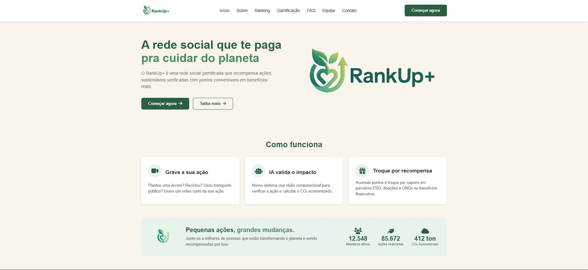
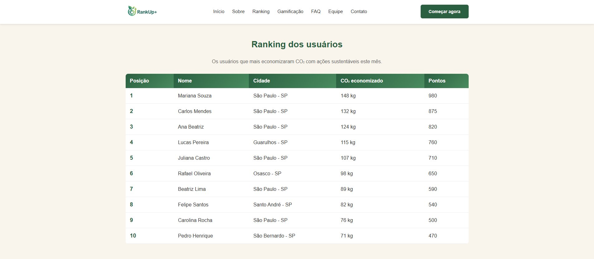
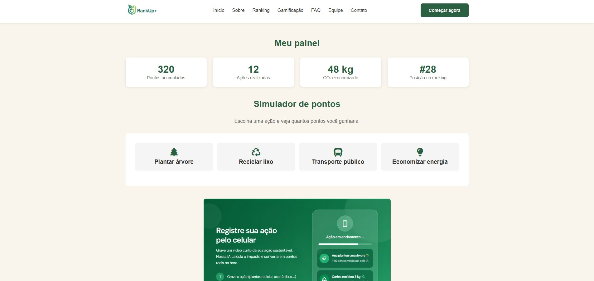

# 🌱 RankUp+ — Sistema de Gamificação Sustentável


> Projeto desenvolvido como parte do **Challenge FIAP 2026 — 1º Semestre**, em parceria com a **SoulUp**.

---

## 📌 Sobre o Projeto

O **RankUp+** é a interface web do **Sistema de Gamificação Sustentável** da plataforma SoulUp. Nosso objetivo é incentivar práticas sustentáveis dentro da comunidade de usuários, transformando ações ecológicas em **pontuação justa e escalável**, com um ranking que recompensa os usuários mais engajados — inclusive com **subsídio total na conta de energia** para o primeiro colocado.

A plataforma permite que o usuário:

- 📹 Envie vídeos comprovando ações sustentáveis (plantar árvores, reciclar, usar transporte público, etc.)
- 🤖 Tenha a ação analisada automaticamente por algoritmos de reconhecimento de imagem
- 🏆 Acumule pontos de 0 a 100 conforme o impacto ambiental da ação
- 📊 Acompanhe seu desempenho em um ranking atualizado em tempo real
- 🎁 Troque pontos por benefícios reais (descontos na fatura de energia, experiências sustentáveis e mais)

---

## 🎯 Objetivo

Construir uma interface web **responsiva, interativa e acessível** que represente de forma realista a solução proposta pelo grupo, aplicando boas práticas de **Front-End Design Engineering**: HTML semântico, CSS escalável e JavaScript funcional.

---

## 🛠️ Tecnologias Utilizadas

| Tecnologia | Finalidade |
|------------|------------|
| **HTML5** | Estrutura semântica das páginas |
| **CSS3** | Estilização, responsividade e identidade visual |
| **JavaScript (Vanilla)** | Interatividade, validações e componentes dinâmicos |
| **Git & GitHub** | Versionamento e colaboração em equipe |

> ⚠️ O projeto foi desenvolvido **sem o uso de frameworks ou bibliotecas externas**.

---

## 📁 Estrutura de Pastas

```
RankUp-Front/
│
├── index.html                  # Página inicial
├── sobre.html                  # Sobre o projeto
├── integrantes.html            # Equipe RankUp+
├── faq.html                    # Perguntas frequentes
├── contato.html                # Formulário de contato
├── ranking.html                # Página da solução: ranking de usuários
├── dashboard.html              # Página da solução: painel do usuário
│
├── README.md                   # Este arquivo
│
└── assets/
    ├── css/
    │   ├── reset.css           # Reset de estilos padrão
    │   ├── style.css           # Estilos globais
    │   └── responsive.css      # Media queries (mobile, tablet, desktop)
    │
    ├── js/
    │   ├── menu.js             # Menu hambúrguer e navegação
    │   ├── validacao.js        # Validação do formulário de contato
    │   ├── faq.js              # Accordion da FAQ
    │   └── ranking.js          # Simulação de pontuação e ranking
    │
    └── img/
        ├── logo/               # Logos do projeto
        ├── integrantes/        # Fotos da equipe
        ├── icons/              # Ícones e ilustrações
        └── prints/             # Prints das telas para documentação
```

---

## 🖼️ Representação do Projeto

### Página Inicial


> Tela de entrada do RankUp+ com o conceito principal da plataforma — "A rede social que te paga pra cuidar do planeta" — e a seção **Como funciona** explicando os três passos: gravar a ação, validação por IA e troca por recompensas.

---

### Ranking dos Usuários


> Página de ranking exibindo os 10 usuários que mais economizaram CO₂ no mês, com posição, nome, cidade, CO₂ economizado e pontuação total.

---

### Meu Painel (Dashboard)


> Painel pessoal do usuário com pontos acumulados, ações realizadas, CO₂ economizado, posição no ranking e o **simulador de pontos** — onde o usuário escolhe uma ação (plantar árvore, reciclar lixo, transporte público ou economizar energia) e visualiza quantos pontos ganharia.

---

## 👥 Autores e Créditos

Projeto desenvolvido pelo **Grupo 5 — Turma 1TDSPJ** (FIAP — Análise e Desenvolvimento de Sistemas):

| Nome | RM | LinkedIn | GitHub |
|------|----|----------|--------|
| Flávio Luiz Kuratomi Junior | 571211 | [LinkedIn](https://www.linkedin.com/in/flavio-luiz-kuratomi-junior-7878ab317/) | [@kkuras](https://github.com/kkuras) |
| Tiago Borges Dos Santos | 569926 | [LinkedIn](https://www.linkedin.com/in/tiago-borges-2251933a6) | [@tiagostnz](https://github.com/tiagostnz) |
| João Victor de Jesus Bernardo | 568729 | [LinkedIn](https://www.linkedin.com/in/joaovjbernardo/) | [@joaovjbernardo](https://github.com/joaovjbernardo) |
| Henrique Osuka | 571324 | [LinkedIn](https://www.linkedin.com/in/henrique-osuka-78a0993b5/) | [@HenriqueOsuka](https://github.com/HenriqueOsuka) |
| Pedro Andreotti Pugliesi | 569357 | [LinkedIn](https://www.linkedin.com/in/pedro-andreotti-8270a3404/) | [@PedroAndreottiPugliesi](https://github.com/PedroAndreottiPugliesi) |

---

## 🔗 Link do Repositório

📂 **Repositório oficial:** [https://github.com/RankUp-TDSPJ/RankUp-Front](https://github.com/RankUp-TDSPJ/RankUp-Front)

---

## 🚀 Como Executar o Projeto Localmente

1. **Clone o repositório:**
   ```bash
   git clone https://github.com/RankUp-TDSPJ/RankUp-Front.git
   ```

2. **Acesse a pasta do projeto:**
   ```bash
   cd RankUp-Front
   ```

3. **Abra o arquivo `index.html`** no navegador de sua preferência (recomendado: Chrome ou Firefox).

> 💡 Não há necessidade de instalar dependências — o projeto roda diretamente no navegador.

---

## 📱 Responsividade

A interface foi desenvolvida para se adaptar a três tamanhos de tela:

- 📱 **Mobile:** até 480px
- 📲 **Tablet:** a partir de 768px
- 🖥️ **Desktop:** a partir de 992px

---

## 📄 Licença

Este projeto foi desenvolvido para fins acadêmicos, como parte do **Challenge FIAP 2026 — 1º Semestre**, em parceria com a SoulUp.

---

<p align="center">
  Feito com 💚 pelo time <strong>RankUp+</strong> — FIAP 2026
</p>
